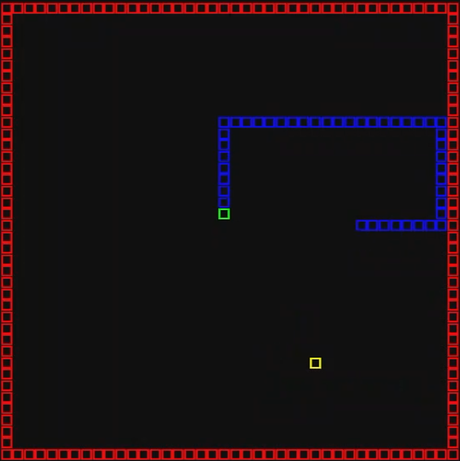

<!-- Improved compatibility of back to top link: See: https://github.com/othneildrew/Best-README-Template/pull/73 -->
<a name="readme-top"></a>
<!--
*** Thanks for checking out the Best-README-Template. If you have a suggestion
*** that would make this better, please fork the repo and create a pull request
*** or simply open an issue with the tag "enhancement".
*** Don't forget to give the project a star!
*** Thanks again! Now go create something AMAZING! :D
-->


<!-- PROJECT SHIELDS -->
<!--
*** I'm using markdown "reference style" links for readability.
*** Reference links are enclosed in brackets [ ] instead of parentheses ( ).
*** See the bottom of this document for the declaration of the reference variables
*** for contributors-url, forks-url, etc. This is an optional, concise syntax you may use.
*** https://www.markdownguide.org/basic-syntax/#reference-style-links
-->
<!-- PROJECT LOGO -->
<br />
<div align="center">
  <a href="https://github.com/Apoorva64/snake-ai-python-neat">
    
  </a>

<h3 align="center">Snake ai</h3>

  <p align="center">
    This the snake game with ai that can play the game at a reasonable level
  </p>
    <a href="https://www.twitch.tv/apoorva64">View Demo</a>
</div>


<!-- TABLE OF CONTENTS -->
<details>
  <summary>Table of Contents</summary>
  <ol>
    <li>
      <a href="#about-the-project">About The Project</a>
      <ul>
        <li><a href="#built-with">Built With</a></li>
      </ul>
    </li>
    <li>
      <a href="#getting-started">Getting Started</a>
      <ul>
        <li><a href="#prerequisites">Prerequisites</a></li>
        <li><a href="#installation">Installation</a></li>
      </ul>
    </li>
    <li><a href="#how-does-it-work">How does it work</a></li>
    <li><a href="#usage">Usage</a></li>
    <li><a href="#contributing">Contributing</a></li>
    <li><a href="#license">License</a></li>
    <li><a href="#contact">Contact</a></li>
  </ol>
</details>


<!-- ABOUT THE PROJECT -->

## About The Project

The project is a snake game with ai that can play the game at a reasonable level.
It is built with pygame and neat-python.
The logic for the game is a fast implementation of the snake game with numba which can be
found [here](https://github.com/Apoorva64/fast-snake-python-numba).
<p align="right">(<a href="#readme-top">back to top</a>)</p>

### Built With

* [Pygame](https://www.pygame.org/news)
* [Numba](https://numba.pydata.org/)
* [Neat-python](https://neat-python.readthedocs.io/en/latest/)
* [Numpy](https://numpy.org/)
* [Pandas](https://pandas.pydata.org/)
* [Jupyter](https://jupyter.org/)
* [Graphviz](https://graphviz.org/)
* [Matplotlib](https://matplotlib.org/)

<p align="right">(<a href="#readme-top">back to top</a>)</p>

## How does it work

### Ai inputs

The ai gets 8 inputs from the game.
The inputs are the distance from the snake to the 4 walls, the distance as well the angle to the food and 4 rays.

### Ai Outputs

The inputs are then fed to the neural network.
The output of the neural network is the direction the snake should move in.
The direction is chosen by taking the direction with the highest output value.

### Fitness function

The fitness function is the score of the snake.
It is calculated using the following rules:

* +1 if the snake gets closer to the food
* -1 if the snake gets further from the food
* +100 if the snake eats the food
* +0.1 for every frame the snake is alive
* stop the game if the snake dies

### Training

The neural network is trained using the neat algorithm.
The neat algorithm is a genetic algorithm that evolves the neural network to play the game.
The neat algorithm is implemented in the neat-python library.
The neat algorithm is explained in
the [neat-python documentation](https://neat-python.readthedocs.io/en/latest/neat_overview.html).

### Visualization

The visualization of the neural network is done using graphviz (click on the "Graph" button in the top right corner of
the visualization window).
The visualization of the training is done using matplotlib (click on the "Plot" button in the top right corner of the
visualization window).
The training is done in the background and the visualization is updated in real time.

#### Additional controls

* Press "p" augment the speed of the game
* Press "o" reduce the speed of the game

<p align="right">(<a href="#readme-top">back to top</a>)</p>

<!-- GETTING STARTED -->

## Getting Started

### Installation

1. Clone the repo and the submodules
   ```sh
   git clone --recurse-submodules https://github.com/Apoorva64/snake-ai-python-neat.git
   ```
2. Install the requirements
   ```sh
    pip install -r requirements.txt
   ```
3. Add the lib/fast_snake/src, src, data folder to the python path
    ```bat
    set PYTHONPATH=%PYTHONPATH%;lib/fast_snake/src;src;data
    ```
4. Run the game
    ```sh
    python src/snake_ai/ai_multiprocessing.py
    ```

<p align="right">(<a href="#readme-top">back to top</a>)</p>


<!-- USAGE EXAMPLES -->

## Usage

You can change settings in the ai_multiprocessing.py file.

```python
RUNS_PER_GAME_SIZE = 10
ENABLE_GUI = True
# GAME_SIZE_RANGE = range(5, 100, 10)
GAME_SIZE_RANGE = [40]
SNAKE_GAME_SIZE = (40, 40)
FOOD_TIMER_MAX = SNAKE_GAME_SIZE[0] * np.sqrt(2)
NUMBER_OF_RAYS = 4
ROTATING_DIRECTIONS = False
INCLUDE_LAST_DIRECTION = False
INCLUDE_SNAKE_LENGTH = False
INCLUDE_WALL_DISTANCE = True
TEMPORAL_LENGTH = 1
CORE_COUNT = multiprocessing.cpu_count() - 1
```

Be careful when changing settings the game will not be able to do visulization on the first run. You must stop the game
and relauch it to get them.

<p align="right">(<a href="#readme-top">back to top</a>)</p>


<!-- CONTRIBUTING -->

## Contributing

Contributions are what make the open source community such an amazing place to learn, inspire, and create. Any
contributions you make are **greatly appreciated**.

If you have a suggestion that would make this better, please fork the repo and create a pull request. You can also
simply open an issue with the tag "enhancement".
Don't forget to give the project a star! Thanks again!

1. Fork the Project
2. Create your Feature Branch (`git checkout -b feature/AmazingFeature`)
3. Commit your Changes (`git commit -m 'Add some AmazingFeature'`)
4. Push to the Branch (`git push origin feature/AmazingFeature`)
5. Open a Pull Request

<p align="right">(<a href="#readme-top">back to top</a>)</p>


<!-- LICENSE -->

## License

Distributed under the MIT License. See `LICENSE` for more information.

<p align="right">(<a href="#readme-top">back to top</a>)</p>


<!-- CONTACT -->

## Contact

Your Name - [@twitter_handle](https://twitter.com/twitter_handle) - email@email_client.com

Project Link: [https://github.com/Apoorva64/snake-ai-python-neat](https://github.com/Apoorva64/snake-ai-python-neat)

<p align="right">(<a href="#readme-top">back to top</a>)</p>


<!-- MARKDOWN LINKS & IMAGES -->
<!-- https://www.markdownguide.org/basic-syntax/#reference-style-links -->

[contributors-shield]: https://img.shields.io/github/contributors/Apoorva64/snake-ai-python-neat.svg?style=for-the-badge

[contributors-url]: https://github.com/Apoorva64/snake-ai-python-neat/graphs/contributors

[forks-shield]: https://img.shields.io/github/forks/Apoorva64/snake-ai-python-neat.svg?style=for-the-badge

[forks-url]: https://github.com/Apoorva64/snake-ai-python-neat/network/members

[stars-shield]: https://img.shields.io/github/stars/Apoorva64/snake-ai-python-neat.svg?style=for-the-badge

[stars-url]: https://github.com/Apoorva64/snake-ai-python-neat/stargazers

[issues-shield]: https://img.shields.io/github/issues/Apoorva64/snake-ai-python-neat.svg?style=for-the-badge

[issues-url]: https://github.com/Apoorva64/snake-ai-python-neat/issues

[license-shield]: https://img.shields.io/github/license/Apoorva64/snake-ai-python-neat.svg?style=for-the-badge

[license-url]: https://github.com/Apoorva64/snake-ai-python-neat/blob/master/LICENSE.txt

[linkedin-shield]: https://img.shields.io/badge/-LinkedIn-black.svg?style=for-the-badge&logo=linkedin&colorB=555

[linkedin-url]: https://linkedin.com/in/linkedin_username

